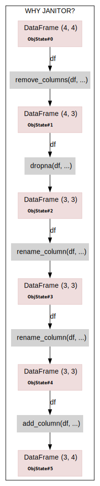

# pyjviz

[test](think-bayes-ch6.py-diagram1.svg)

`pyjviz` is Python package to deliver some level of visual support to help programmers and data engeneers to use `pyjanitor` package.
`pyjviz` provides simple way to see method call chains flow and intermidiate results.
`pyjviz` will work when you run the jupyter notebooks. Traditional python script runs are also welcome - in this case visualization results will be stored in your home directory location ~/.pyjviz

## Installation

```
pip install pyjanitor rdflib graphviz
pip install ipython matplotlib
git clone https://github.com/pyjanitor-devs/pyjviz.git
cd pyjviz
pip install -e .
```

## Quick examples

Consider pyjanitor example [why-janitor.py](https://github.com/pyjanitor-devs/pyjviz/blob/main/examples/scripts/why-janitor.py).
<table>
<tr><td>

```python
# using example from https://pyjanitor-devs.github.io/pyjanitor/#why-janitor
# as starting point

import numpy as np
import pandas as pd
import janitor
import pyjviz

# Sample Data curated for this example
company_sales = {
        'SalesMonth': ['Jan', 'Feb', 'Mar', 'April'],
        'Company1': [150.0, 200.0, 300.0, 400.0],
        'Company2': [180.0, 250.0, np.nan, 500.0],
        'Company3': [400.0, 500.0, 600.0, 675.0]
    }

print(pd.DataFrame.from_dict(company_sales))

with pyjviz.CB("WHY JANITOR?") as sg:
    df = (
        pd.DataFrame.from_dict(company_sales)
        .remove_columns(["Company1"])
        .dropna(subset=["Company2", "Company3"])
        .rename_column("Company2", "Amazon")
        .rename_column("Company3", "Facebook")
        .add_column("Google", [450.0, 550.0, 800.0])
    )
    print(df)

pyjviz.save_dot(vertical = True, popup_output = True)
```

</td><td><a target = "_blank" href="why-janitor.py.ttl.dot.svg"></a></td></tr>
</table>

The [`resulting SVG file`][res] of the run shows method chain calls along with intermediate return and argument objects. It has clickable nodes to provide the details of program behaviour and generated data objects.

[res]: why-janitor.py.ttl.dot.svg

## How it works?

`pyjviz` provides the way to create logfile which contains RDF graph of program behaviour. The visualization features of pyjviz provided in the package itself are based on RDF graph translation to graphviz dot lanuage. `pyjanitor` method chains are represented using certain RDF data schema (ref here to shacl defs). Using `pandas` extentions API `pyjanitor` (and `pandas`) method call arguments and returns are saved into RDF log.

> **Note**
> Visualisation of pyjviz RDF graph is not a main goal of provided package. Graphviz-based visualization avaiable in the package is rather reference implementation with quite limited (but still useful) capablities.

Python objects from `pyjviz` point of view have `object identity` and `object state`. Both of them are treated as abstract i.e. have no visual representation useful for the user in most cases. However `pyjviz` introduces the notion of `object state _Carbon_Copy_` or ObjectCC. Object carbon copy is well-defined representation of the python object useful for the user as visual primitive - and possibly more than that.

E.g. the simplest form of pandas dataframe 'carbon copy' can be obtained via using output of method head() then converted to HTML format - result of df.head().to_html() call. More comprehensive CC would be dataframe plot as generated by .plot method and saved as byte sequence. Note that 'carbon copy' is not necessary capture all details of original object state. If one need to have precise object state she would have to use CC class which guarantee that. CC like that would be based on .to_csv method in example above.

The way how particular call argument/return or other python objects are saved into RDF log is specified using CCGlance `carbon copy` class. For pandas dataframe it will save just shape of dataframe and its head() output serialized as HTML. If user wants to have other CC of the object it is always possible to use .cc() method ((ref here, rename .pin() to .cc())

--------

Obj is representation of pyjanitor object like pandas DataFrame. However input args are not objects rather object states. The state of object is represeneted by RDF class ObjState. The idea to separate object and object state is introduced to enable pyjviz to visualize situation when object has mutliple states used in method chain due to in-place operations. Such practice is discouraged by most of data packages but still may be used. In most cases where object has only state defined when object is created there is not difference betwen object and object state since there is one-to-one correspondence (isomorfism). So in some context below refernce to an object may imply object state instead.

pyjviz also introduce MethodCall RDF class. It represents pyjanitor method call. MethodCall object has incoming links from input objects and outgoing link an object representing retirn object.
